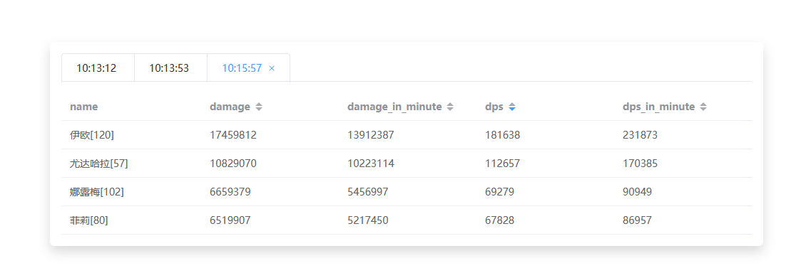

# GBFR-ACT
## Granblue Fantasy Relink - Analytics for Combat Tracking

### TODO
1. ~~Log Export~~
2. ~~Use Timestamp but not Date.now() to deal with Chrome's background tab restriction~~
3. A better parent actor detection
4. Flags for damage calculation, such as crit, or damage cap
5. More event type support

### 备注
1. **关于伤害动作构成**
   - 动作名称来源于群众提供，可能存在错误，错漏欢迎issue或者pr
2. **关于统计错误**
   - 统计数据来源于半瓶水逆向分析，如发现错误数据请附带复现步骤（什么环境，什么动作，理论多少记录多少）（f12控制台有事件输出）提issue
3. **关于图表绘制间隔过长**
   - 由于chrome对于背景标签页的限制，可能会导致图表绘制间隔过长

### 步骤

1. **安装python311**
   - 下载链接: [https://www.python.org/ftp/python/3.11.6/python-3.11.6-amd64.exe](https://www.python.org/ftp/python/3.11.6/python-3.11.6-amd64.exe)
   - 注：建议以管理员权限安装
   - 注2：本脚本对conda环境支持不好，建议不要使用conda环境

2. **运行act_ws.py或uac_start.cmd**
   - 双击运行`act_ws.py`或`uac_start.cmd`，如果不出问题会弹出一个cmd窗口描述ACT已经安装成功

3. **打开act_ws.html**
   - 建议使用Chrome浏览器打开`act_ws.html`

### Remarks
1. **About damage action composition**
   - The action names are provided by the public, and there may be errors. If you find any, please feel free to open an issue or a pull request.
2. **About statistical errors**
   - The statistical data is based on incomplete reverse engineering. If you find any incorrect data, please provide the reproduction steps (what environment, what action, how many records are theoretically recorded) (f12 console has event output) to open an issue.
3. **About the long interval of chart drawing**
   - Due to the restrictions of Chrome on background tabs, it may cause the interval of chart drawing to be too long.

### Steps

1. **Install Python 3.11**
   - Download link: [https://www.python.org/ftp/python/3.11.6/python-3.11.6-amd64.exe](https://www.python.org/ftp/python/3.11.6/python-3.11.6-amd64.exe)
   - Note: It is recommended to install with administrator privileges.
   - Note 2: This script does not support conda environments well, it is advised not to use conda environments.

2. **Run act_ws.py or uac_start.cmd**
   - Double-click `act_ws.py` or `uac_start.cmd` to run. If there are no issues, a cmd window will pop up indicating that ACT has been successfully installed.

3. **Open act_ws.html**
   - It is recommended to use Chrome browser to open `act_ws.html`.
